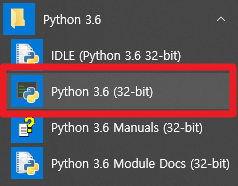

## Python 환경 테스트

### 1. VS Code의 경우

(1) Python V3를 설치한다. 설치시 "Add Python 3.x PATH" 또는 그에 유사한 옵션이 있으면 선택한다. python이 설치된 경로를 시스템의 PATH에 추가하면 python 파일의 경로를 지정하지 않아도 실행이 가능하다.

(2) VS Code를 설치, 실행한다.

(3) 화면 왼쪽 가장자리 세로 메뉴 끝의 extension아이콘을 선택한다. 

* 

(4) 아래 그림의 (1) -> (2) -> (3) 순서대로 작업해서 Python extension을 설치한다.

* 

(5) VS Code를 재시작 한다.

(6) test1.py라는 이름의 스크립트를 아래와 같이 작성하고 화면의 아무곳에서나 마우스 오른쪽 버튼을 눌러 "Run Python File in Terminal"을 실행한다. 결과는 하단 터미널 창에 출력된다.
* 

### 2. 텍스트 에디터 & CLI 실행

```
# 파일이름 test.py

print("Hello World. \nMy name is " + "Openbase" + "." )

print("Hello World. \nMy name is {}.".format("Openbase"))

```

위 코드를 test.py라는 이름으로 저장하고, 윈도우 CMD 창에서 test.py 파일이 있는 경로로 이동한다.

아래 명령어로 test.py를 python으로 인터프리팅(실행)한다.

```
python.exe test.py
```

결과가 CMD(표준출력)에 표시된다.


## 기타: python.org에서 python을 설치한 경우 IDE 사용

* 

