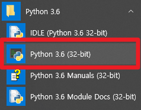
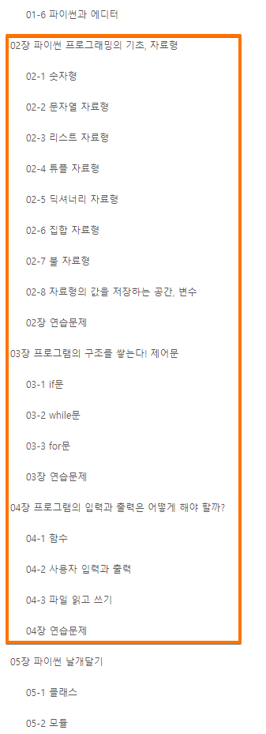

# Python 작업 환경

---------------------

## Python

인터프리터의 배포 버전은 여러가지가 있을 수 있는데 일반 작업은 기본 python으로 가능하며, 모듈 추가 필요시 pip로 설치하면 된다. 번거로운 모듈 추가를 줄이기 위해서 Anaconda와 같이 다양한 모듈이 포함된 배포판을 설치할 수도 있다. 선택의 문제이며, 어느 쪽이 절대적으로 좋은 것은 아니다. 
Anaconda는 사용이 편리하지만 설치 파일이 크고 디스크 사용량이 많다.

### python.org
* [https://www.python.org](https://www.python.org)
* 인터프리터 다운로드 및 문서 참고

### Anaconda
* Anaconda download: 
  * [https://www.anaconda.com/download](https://www.anaconda.com/download) 또는 
  * [https://www.anaconda.com/products/individual-d](https://www.anaconda.com/products/individual-d)
* Python 인터프리터의 배포판 중 하나. 다양한 데이터 처리 모듈이 동반 패키징 됨.

### Python 버전 선택

대부분 인터프리터들과 달리 Python은 버전 2.x ~ 3.x 사이에 하위 호환성이 없다. 버전2 코드를 버전3에서 실행하려면 수정해야한다. 

버전3에서 개선,추가된 것들이 많으므로 다음 경우가 아니면 버전3을 사용한다.

#### 부득이 버전 2를 써야하는 경우
1. 스크립트를 돌리는 환경이 Python 버전2인데 업그레이드 할 수 없다.
2. 이미 쓰고 있는 스크립트를 수정하려고 하는데, 그 스크립트가 Python 버전2 이다. -> 버전3으로 수정할 수 있는 분량이라고 하더라도 수정후 기존 동작을 검증할 자신이 없으면 수정하지 않는 게 좋다. #사실상 하지 말 것.

---------------------

## 에디터

* 메모장, vi 
* notepad++ 
* VS Code(Visual Studio Code)
* jupyter notebook (ipython)
* PyCharm이나 다른 Python 전용 에디터
  * [pycharm](https://www.jetbrains.com/ko-kr/pycharm/download/)
  
---------------------

## Python 환경 구성하기 / VS Code의 경우

* VS Code를 쓰지 않는다면 (1)이후 (6-2)로 점프

(1) Python V3를 설치한다. 설치시 "Add Python 3.x PATH" 또는 그에 유사한 옵션이 있으면 선택한다. PATH를 지정하면 아무 경로에서나 python 실행이 가능하다.

(2) VS Code를 설치, 실행한다.

(3) 화면 왼쪽 가장자리 세로 메뉴 끝의 extension아이콘을 선택한다. 

* 

(4) 아래 그림의 (1) -> (2) -> (3) 순서대로 작업해서 Python extension을 설치한다.

* 

(5) VS Code를 재시작 한다.

(6-1) test1.py라는 이름의 스크립트를 아래와 같이 작성하고 화면의 아무곳에서나 마우스 오른쪽 버튼을 눌러 "Run Python File in Terminal"을 실행한다. 결과는 하단 터미널 창에 출력된다.
* 

(6-2) test1.py라는 이름의 스크립트를 에디터에서 아래와 같이 작성하고, cmd윈도우에서 "python.exe test1.py"로 실행한다. cmd 윈도우(표준출력)에 출력된다.
* 

## python.org에서 python을 설치한 경우 IDE 사용

* 

---------------------

## Python 교재 추천

점프 투 파이썬: [https://wikidocs.net/book/1](https://wikidocs.net/book/1)
* 15년 이상 업데이트되고 있는 무료 파이썬 강좌 사이트. 책으로도 출판됨.
* 파이썬의 기본부터 잘 설명

## Python 활용 기본 지식: 

* 자료형, 제어구조, 입출력
* 점프 투 파이썬(https://wikidocs.net/book/1) 2, 3, 4장

* 

---------------------
