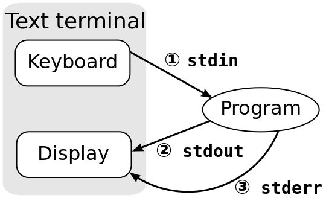

## 3. Python basic -2

### 자료형 - list
[https://wikidocs.net/14](https://wikidocs.net/14)

#### iterable(collections.Iterable)

* iterable 객체 - 반복 가능한 객체
* 대표적 iterable 타입 - list, tuple(튜플), dict, set(집합), str(문자열), bytes, range
* list는 iterable의 속성을 가짐


* 리스트 샘플

```
num = [0, 1, 2, 3, 4, 5, 6, 7, 8, 9, 10]

```
#### list 다루기

* 인덱싱
* 슬라이싱
* 더하기: append vs extend에서 설명
* 0이 200개 있는 list 만들기
```
???
``` 
* 길이
* 요소 수정
* 요소 삭제: del
```
del num[4]
```

* iteration 중 요소 삭제 주의!! - 결과를 예측할 수 없음
```
num = [0, 1, 2, 3, 4, 5, 6, 7, 8, 9, 10]

for i in range(11):
    print(f'del num[{i}]:{num[i]}')
    del num[i]
    print(f'result num:{num}')
```

* append vs extend

  * append: list 끝에 요소 하나를 추가
  * extend: list에 다른 list를 붙여서 "연장"
  * 더하기: list1과 list2를 더해 새 list를 만듦. list1과 list2는 변하지 않음

```
num.append(100)
num.extend([201, 202])
new = num + [301, 302]
```

* list 정렬
```
a = [1, 4, 3, 2]
a.sort()

b = ['김하나', '이둘', '박셋', '류넷', 'Kim YK']
b.sort()
```

* append()와 insert()의 차이
  * append는 끝에 요소 추가, insert는 지정한 위치에 끼워넣기

* del과 pop()의 차이
  * del은 요소 제거, pop()은 맨끝에서 요소를 꺼냄(list에서는 제거 효과)

### 자료형 - 튜플

[https://wikidocs.net/15](https://wikidocs.net/15)

* 대부분 속성이 리스트와 같으나 한번 정한 값을 변경할 수 없음

* tuple의 사용
```
def calculate(input):
    return input*10, input/10


multi, div = calculate(550)
ret = calculate(550)  # ret의 type은?
```


### 실습:

* 숫자 목록을 입력받아 짝수만 걸러내기
```

def filter_even(input_str):
    # lines of code
    return even_numbers


def read_input():
    pass


if __name__ == '__main__':
    input_data = read_input()
    ret = filter_even(input_data)
    print(ret)
```

### 참고: 표준 출력/표준 에러/표준 입력

